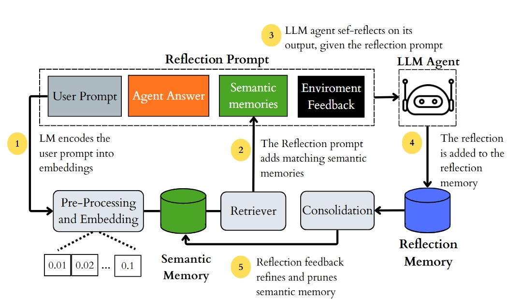

# Bridging Reflective and Semantic Memory for Lifelong Learning in LLM-based Agents

This project implements and evaluates a memory-augmented framework for LLM agents that combines two complementary memory types: **Semantic Memory** and **Reflective Memory**. The work is presented in the paper *"Bridging Reflective and Semantic Memory for Lifelong Learning in LLM-based Agents"* (EMAS @ AAMAS 2026).

---

## Unified Reflective-Semantic Memory Architecture



*Figure 1: Our unified memory architecture establishing a bidirectional interaction between reflection and semantic memories.*

Modern LLM agents tend to repeat mistakes because they lack a structured way to learn from past experience. This framework addresses that by introducing a unified architecture in which semantic and reflective memory interact bidirectionally:

- **Semantic Memory:** A vector store of scientific facts and principles retrieved via embedding similarity. When the agent receives a question, relevant facts are fetched and injected into the prompt to ground the reasoning.
- **Reflective Memory:** Stores the agent's self-reflections after each answer. These reflections capture what went right or wrong and are used to refine and prune the Semantic Memory over time.

### How it works (5 steps)

1. The Language Model (LM) encodes the user prompt into embeddings.
2. The Retriever fetches matching semantic memories and adds them to the Reflection prompt.
3. The LLM agent self-reflects on its output, given the reflection prompt (which includes the User Prompt, Agent Answer, Semantic Memories, and Environment Feedback).
4. The reflection is added to the Reflection Memory.
5. The reflection feedback refines and prunes the Semantic Memory via the Consolidation module.

The benchmark used is the **ARC Challenge** dataset (science multiple-choice questions), and the framework is tested against baselines such as plain RAG, no-memory, and self-refinement approaches.

---

## Key Results

Our experiments on the ARC Challenge dataset demonstrate that bridging reflective and semantic memory significantly improves reasoning performance while managing memory growth and quality.

### Accuracy Performance

The integration of Dynamic Pruning (DP) and Self-Refinement (DP++) into the concatenated memory architecture yields the highest accuracy gains.

| Configuration | Validation Accuracy (%) | Test Accuracy (%) |
| :--- | :---: | :---: |
| Baseline (No Memory) | 69.57 | 65.96 |
| Reflection | 70.23 | 68.86 |
| Semantic | 70.90 | 69.28 |
| Concatenated | 72.91 | 70.99 |
| Semantic-DP | 73.58 | 70.05 |
| Concatenated-DP | 76.25 | 72.01 |
| Semantic-DP++ | 76.59 | 70.65 |
| **Concatenated-DP++ (Ours)** | **78.26** | **73.12** |

### Semantic Memory Curation

Active memory curation through selective forgetting and rewriting not only optimizes the memory bank size but also actively reduces the retrieval of harmful or misleading knowledge during reasoning.

| Configuration | Valid. Size | Valid. Harmful (%) | Test Size | Test Harmful (%) | Retrieved Harmful (%) |
| :--- | :---: | :---: | :---: | :---: | :---: |
| Semantic | 3,286 | 47.47 | 3,286 | 47.47 | 46.03 |
| Concatenated | 3,286 | 47.47 | 3,286 | 45.88 | 47.47 |
| Semantic-DP | 2,512 | 47.47 | 2,512 | 43.51 | 35.17 |
| Concatenated-DP | 2,512 | 47.47 | 2,512 | 43.51 | 37.08 |
| Semantic-DP++ | 3,993 | 46.51 | 3,504 | 39.44 | 32.54 |
| **Concatenated-DP++** | 3,993 | 46.51 | **3,559** | **39.48** | **32.55** |

---

## Setup

### 1. Clone the repository

```bash
git clone https://github.com/your-username/bridging-reflective-and-semantic.git
cd bridging-reflective-and-semantic
```

### 2. Create and activate the Conda environment

```bash
conda env create -f environment.yml
conda activate agent_lab
```

### 3. Configure the `.env` file

Create a `.env` file at the root of the project with your API credentials:

```env
OPENAI_API_KEY=your_openai_api_key_here
```

> Other keys (e.g., for alternative LLM providers) can be added here as needed by the notebooks.

### 4. Download and set up the ARC Challenge dataset

Download the **ARC Challenge** dataset from the [Allen AI ARC page](https://allenai.org/data/arc) and place the split files inside the `dataset/` folder:

```text
dataset/
  arc_challenge_train_processed.csv
  arc_challenge_valid_processed.csv
  arc_challenge_test_processed.csv
```

---

## Running the Experiments

All experiments are implemented as Jupyter Notebooks inside the `Playground/` directory, organized by approach:

| Folder | Description |
|---|---|
| `Playground/no_memory/` | Baseline — LLM with no memory |
| `Playground/RAG/` | RAG-based approaches (semantic, hybrid, reflection) |
| `Playground/Self_Refinement/` | Self-refinement variants |
| `Playground/Dynamic_Pruning/` | Dynamic memory pruning strategies |

Open and run the notebooks in order within each folder. Results and analysis notebooks are available under `results/`.

---

## Project Structure

```text
.
├── dataset/                  # ARC Challenge splits
├── Playground/               # Experiment notebooks
│   ├── no_memory/
│   ├── RAG/
│   ├── Self_Refinement/
│   ├── Dynamic_Pruning/
│   ├── prompts/              # Prompt templates
│   └── vectorstore/          # Memory module implementations
├── results/                  # Analysis and reporting notebooks
├── src/                      # (WIP) Modular source code
├── utils_notebook.py         # Shared utilities
├── environment.yml           # Conda environment
└── README.md
```

---

## Citation

If you use this work, please cite:

```bibtex
@inproceedings{bridging2026,
  title     = {Bridging Reflective and Semantic Memory for Lifelong Learning in LLM-based Agents},
  booktitle = {EMAS Workshop @ AAMAS 2026},
  year      = {2026}
}
```
